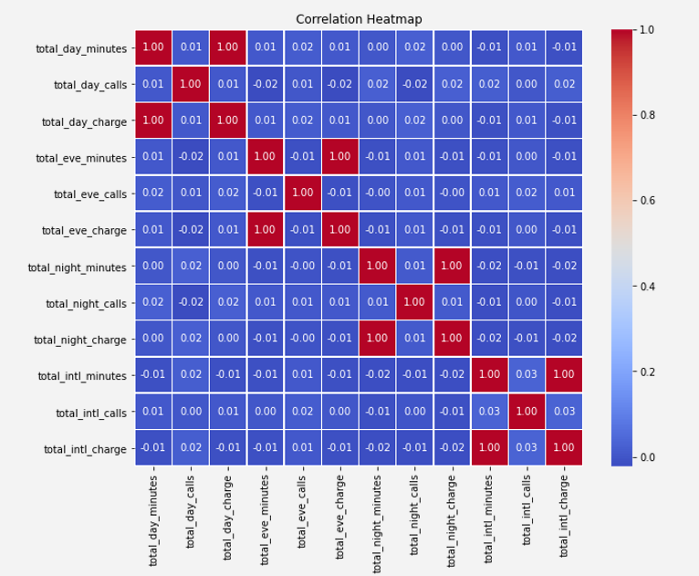
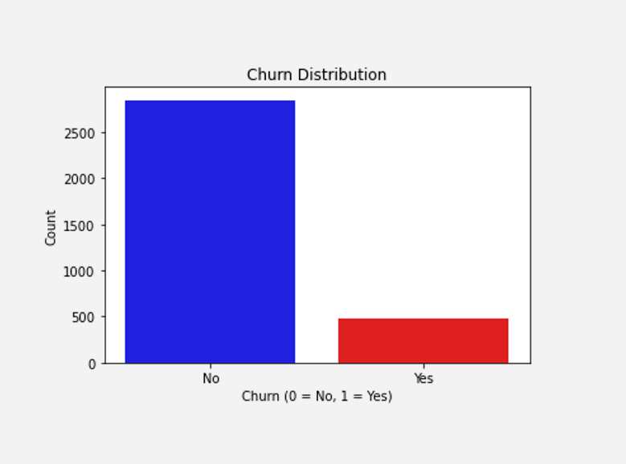
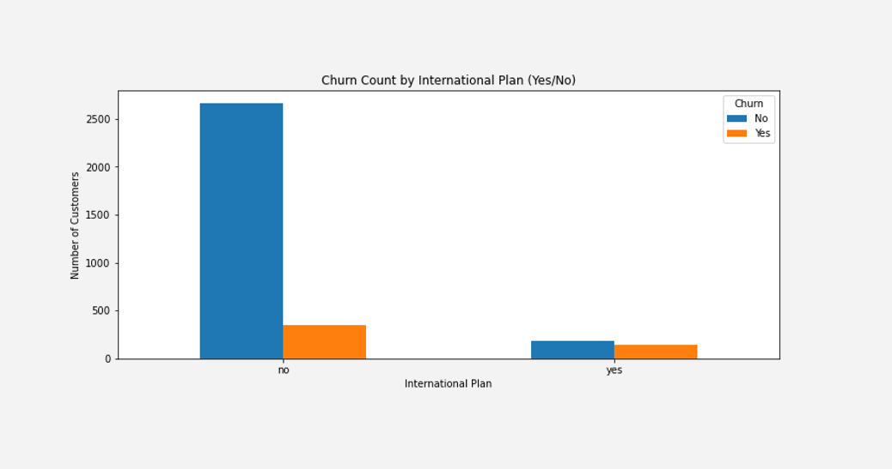
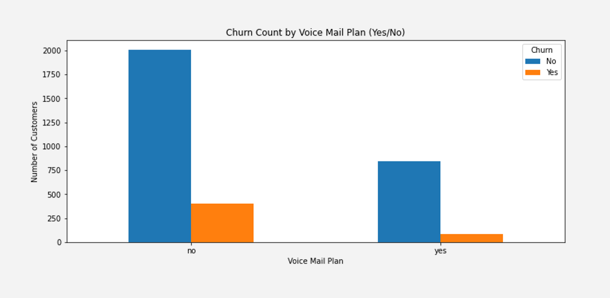
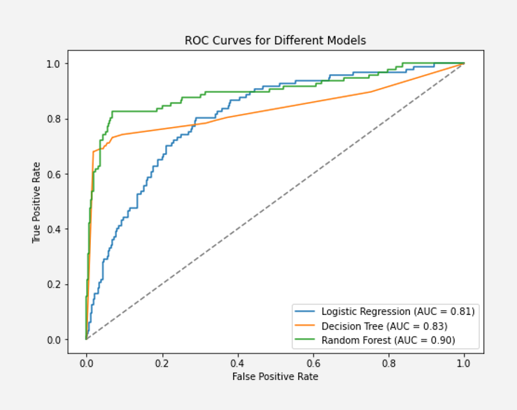
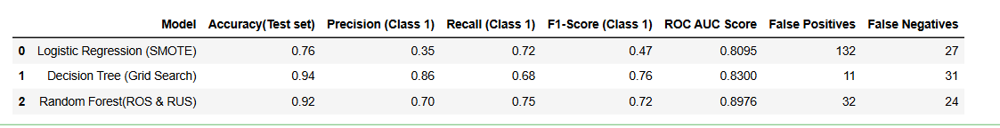
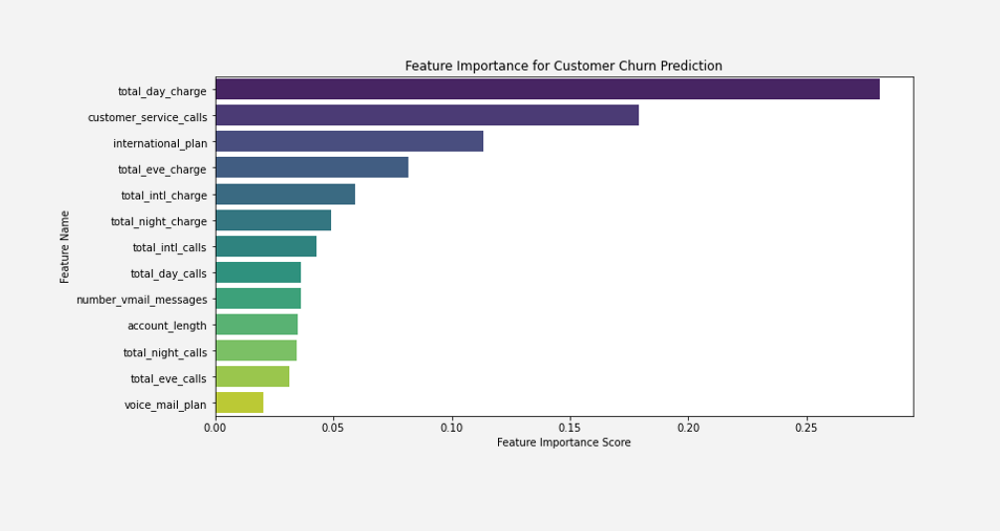

# PREDICTING CUSTOMER CHURN FOR SYRIATEL: IDENTIFYING PATTERNS TO IMPROVE RETENTION

**Author**: Ian Bett  

##  Project Overview
SyriaTel, a leading telecommunications company, is facing significant customer churn, leading to revenue loss and increased competition. Understanding and predicting churn is crucial to refining marketing strategies and improving customer satisfaction.  

In the telecom industry, **customer retention is more cost-effective than acquisition**. With a rapidly expanding market, **minimizing churn rates is essential to maintaining profitability**. By leveraging churn prediction models, SyriaTel can identify customers at risk of leaving and implement proactive retention strategies.  

## Business Understanding

###  Business Problem 
Customer churn directly impacts revenue. Identifying at-risk customers allows the company to implement retention strategies, **reducing losses and improving customer satisfaction**.  

### Key Questions: 
- What factors influence churn?  
- Which model can predict churn with the highest accuracy?  
- What actionable strategies can SyriaTel implement to retain customers and reduce churn?  

## Data Understanding

The **Churn in Telecom** dataset from Kaggle provides insights into customer behavior and their likelihood of canceling their subscriptions. Our goal is to develop a predictive model that minimizes financial losses associated with churn.  

### Dataset Overview 
- **Total Records:** **3,333 rows**  
- **Total Features:** **21 columns**  
- **Target Variable:** `churn` (**Binary classification: True/False**)  
- **Feature Categories:**  
  - **Customer Demographics:** `state`, `account length`, `area code`, `phone number`  
  - **Service Plans:** `international plan`, `voice mail plan`  
  - **Usage Behavior:** `total minutes`, `total calls`, `total charges` across different time periods (day, evening, night, international)   - **Customer Support Interaction:** `customer service calls`  

## Data Preparation

### 1. Data Cleaning
- Checked for missing values.
- Renamed columns to eliminate white spaces for consistency.  

### 2. Handling Multicollinearity  

- **Highly correlated features were removed** to improve model performance:  
  - `total day minutes` & `total day charge`  
  - `total eve minutes` & `total eve charge`  
  - `total night minutes` & `total night charge`  
  - `total intl minutes` & `total intl charge`  
- Since charges are directly derived from minutes, **keeping only charges prevents redundancy**.  

### 3. Feature Selection  
- **Dropped Irrelevant Features:**  
  - `state`, `area code`, and `phone number` (**not really useful for prediction**).
  
### 4. Label Encoding
- **Converted Categorical Variables into Numerical Data** (e.g., `churn`,`international plan` and `voice mail plan`).  

## Exploratory Data Analysis (EDA)

### Churn Distribution  
- The dataset is **imbalanced**, with a higher proportion of non-churners. Balancing of the Classes must be addressed.

#### 1. Churn Rate by International Plan 

### Key Findings
- **Customers without an international plan are more likely to stay.**  
- **Among customers with an international plan, churners are fewer than non-churners.**  

#### 2. Churn Rate by Voice Mail Plan 

- **Customers without a voice mail plan are more likely to stay.**  
- **Among customers with a voice mail plan, churners are fewer than non-churners.**  

## Modeling  

###  Goal:
Find a model that balances **recall** (identifying actual churners) and **precision** (reducing false alarms).  

### Baseline Model Observations
- Initial models showed **overfitting** with high training accuracy but poor generalization.  
- Addressed this by balancing the dataset and optimizing hyperparameters.  

## Model Performance Analysis  

### 1. Logistic Regression (SMOTE)
- **Accuracy:** 76%  
- **Recall:** 72% (*Identifies most churners but misclassifies some non-churners as churners*).  
- **Precision:** 35% (*High false positives mean unnecessary retention efforts*).  
- **Best Use Case:** If the company prioritizes catching **as many churners as possible**, even at the cost of some false alarms.  

###  2. Decision Tree (GridSearchCV Optimization)
- **Accuracy:** **93.7%**  
- **Precision:** **86%** (Better at correctly predicting churners).  
- **Recall:** **68%** (Misses some churners). 

- **Confusion Matrix Insights:**  
- **True Positives (TP) = 66** → Correctly predicted Class 1.  
- **True Negatives (TN) = 559** → Correctly predicted Class 0.  
- **False Positives (FP) = 11** → Class 0 wrongly classified as Class 1.  
- **False Negatives (FN) = 31** → Class 1 wrongly classified as Class 0.  

  - **Low false positives** → **Fewer non-churners incorrectly flagged**.  
  - **Higher false negatives** → **Some actual churners are missed**.  

- **Strengths:**  
   **High accuracy**  
   **Minimal overfitting**  
   **Effective at classifying non-churners**  

- **Weakness:**  
   **Misses some churners (lower recall)**  

### 3. Random Forest (ROS & RUS Applied) 
- **Accuracy:** **91.45%**  
- **Precision:** **70%** (Better than logistic regression).  
- **Recall:** **75%** (Better than decision tree).  
- **Best Balance Between Precision and Recall.**  

- **Confusion Matrix Insights:**  
  - **True Positives:** **73 churners correctly identified**.  
  - **True Negatives:** **538 non-churners correctly identified**.  
  - **False Positives:** **32 customers wrongly classified as churners**.  
  - **False Negatives:** **24 actual churners missed**.  

**Recommended Model: Random Forest Classifier**  
- **Best balance between precision and recall.**  
- **Strong generalization ability with high accuracy (91.45%).**  
- **More reliable in practical use for SyriaTel.**  

## Evaluation & Comparison  

### Model Performance Summary

 **Random Forest is the best choice for SyriaTel** because of its **high recall (catching churners) and strong accuracy.**  
 
## Feature Importance 

## Key Business Recommendations

**Improve Customer Support**  
   - Reduce response times and enhance service quality, as **customer service interactions are a top predictor of churn.**  

**Revise Pricing Strategies**  
   - Customers with high **day, evening, and international charges** tend to churn. **Offer competitive pricing plans** to retain them.  

**Personalized Retention Strategies**  
   - Provide **customized offers** to high-usage customers based on their usage patterns.  

**Loyalty & Incentive Programs**  
   - Offer discounts, rewards, or **exclusive benefits** to high-value customers **before they consider leaving**.  

## Conclusion 

**Random Forest is the optimal model for predicting customer churn at SyriaTel.**  
**Strategic retention efforts should focus on pricing, customer service, and personalized plans.**  
**Proactive engagement with high-risk customers can significantly reduce churn and increase profitability.**  

## Technologies Used

- **Python** 
- **NumPy, Pandas**   
- **Matplotlib, Seaborn** 
- **Scikit-Learn (Logistic Regression, Decision Tree, Random Forest)** 
- **GridSearchCV**
- **StandardScaler, LabelEncoder** 
- **SMOTE, RandomOverSampler, RandomUnderSampler**  
- **Metrics (Accuracy, Precision, Recall, F1-Score, ROC Curve, AUC Score,classification_report, Confusion Matrix)** 
